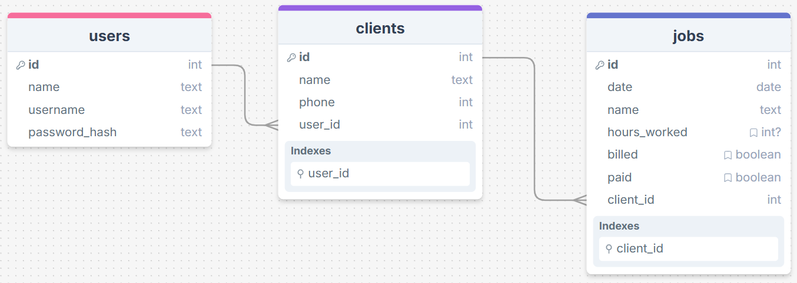

# Sprint 1 - A Working UI Prototype

## Sprint Goals

Develop a prototype that simulates the key functionality of the system, then test and refine it so that it can serve as the model for the next phase of development in Sprint 2.

[Figma](https://www.figma.com/) is used to develop the prototype.

---

## Initial Database Design

This is the initial design for the database, there's 3 linked tables; users so people can login, which have multiple clients, then the jobs for that specific client with different data for the clients and jobs.

### Required Data Input

The end user will input data about the clients and the jobs that are in progress once they have created an account and logged in. There is a checkbox to tick whether the client has been billed for a job and if it has been paid for.

### Required Data Output

The system will output in multiple different ways.
- A list of the clients
- A list of jobs for the clients
- Details of job and clients (e.g. client phone number)

### Required Data Processing

Replace this text with a description of how the data will be processed to achieve the desired output(s) - any processes / formulae?

---

## UI 'Flow'

The first stage of prototyping was to explore how the UI might 'flow' between states, based on the required functionality.

This Figma demo shows the initial design for the UI 'flow':

<iframe style="border: 1px solid rgba(0, 0, 0, 0.1);" width="500" height="600" src="https://embed.figma.com/proto/Q9xEITd8R42lUy8kyq2HNl/Client-Tracker-V1?scaling=min-zoom&content-scaling=fixed&page-id=0%3A1&node-id=3-2&starting-point-node-id=3%3A2&embed-host=share" allowfullscreen></iframe>

### Testing

I talked to my end user and they gave a bit of feedback

> It'd be good if being able to add clients and jobs was on the page with the info

> How can I edit information?

### Changes / Improvements

I took the feedback and I have made the add new client on the same page as where they're shown and added somewhere to edit client info

<iframe style="border: 1px solid rgba(0, 0, 0, 0.1);" width="500" height="600" src="https://embed.figma.com/proto/FSPwNSzLv13aoWvZkzDdXf/Client-Tracker-V2?node-id=3-2&p=f&scaling=min-zoom&content-scaling=fixed&page-id=0%3A1&starting-point-node-id=3%3A2&embed-host=share" allowfullscreen></iframe>

---

## Initial UI Prototype

The next stage of prototyping was to develop the layout for each screen of the UI.

This Figma demo shows the initial layout design for the UI:

<iframe style="border: 1px solid rgba(0, 0, 0, 0.1);" width="500" height="600" src="https://embed.figma.com/proto/gqJUY3nrOPYKh8m0HM6zL3/Client-Tracker-Prototype-V1?node-id=1-2&p=f&scaling=scale-down&content-scaling=fixed&page-id=0%3A1&starting-point-node-id=1%3A2&embed-host=share" allowfullscreen></iframe>

### Testing

I tested the prototype by clicking all the buttons through every screen in Figma to make sure everything works as expected but the adding clients and jobs felt like it should be easier and quicker to get to

### Changes / Improvements

The add new clients is on the home page and I added an edit page so information doesn't have to be deleted and added as a new entry

<iframe style="border: 1px solid rgba(0, 0, 0, 0.1);" width="500" height="600" src="https://embed.figma.com/proto/yQ0tczpGE5WOXe24VFk46A/Client-Tracker-Prototype-V2-Colour?node-id=1-2&p=f&scaling=scale-down&content-scaling=fixed&page-id=0%3A1&starting-point-node-id=1%3A2&embed-host=share" allowfullscreen></iframe>

---

## Refined UI Prototype

I only coloured the buttons with a dark blue, and white text for contrast to make it easier for my end user. I did not add too much colour to make it brighter and easier to read. I wanted it to be simple and proffessional so I left the default font to make it easy to read.

This Figma demo shows the UI with refinements applied:

<iframe style="border: 1px solid rgba(0, 0, 0, 0.1);" width="500" height="600" src="https://embed.figma.com/proto/Jhz7mOPhsZBSu9QH9oTuCK/Client-Tracker-Prototype-V1-Colour?node-id=1-2&p=f&scaling=scale-down&content-scaling=fixed&page-id=0%3A1&starting-point-node-id=1%3A2&embed-host=share" allowfullscreen></iframe>

### Testing

For testing I checked all the buttons are working and navigating to the correct place and it is understandable

### Changes / Improvements

I added back in the edit page because I realized I missed it in the last version and added colour to those pages too

<iframe style="border: 1px solid rgba(0, 0, 0, 0.1);" width="500" height="600" src="https://embed.figma.com/proto/yQ0tczpGE5WOXe24VFk46A/Client-Tracker-Prototype-V2-Colour?node-id=1-2&p=f&scaling=scale-down&content-scaling=fixed&page-id=0%3A1&starting-point-node-id=1%3A2&embed-host=share" allowfullscreen></iframe>

---

## Sprint Review

This sprint has moved the project forward by helping how to start and what to do, by starting on Figma it helps give an idea on what needs to be done and what functions need to be added before I start coding the app, it saves a lot of time. Some challenges were remembering the necessary pages, such as the edit page and making sure the 'flow' was clear. Testing let me identify and fix any problems I had. If I had more time I would've spent more time refining the design, by styling and adding more colour to enchance usability and look more visually appealing